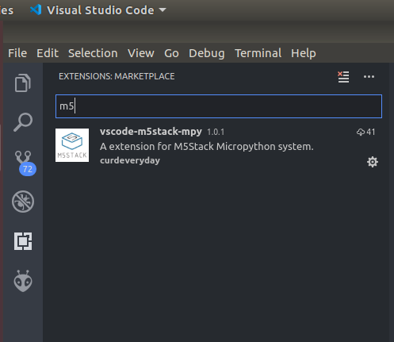
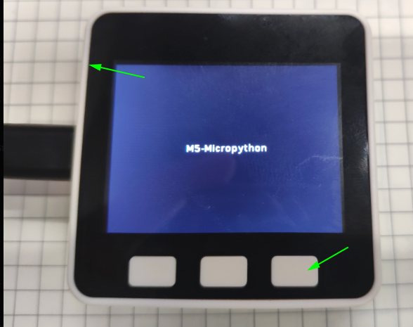
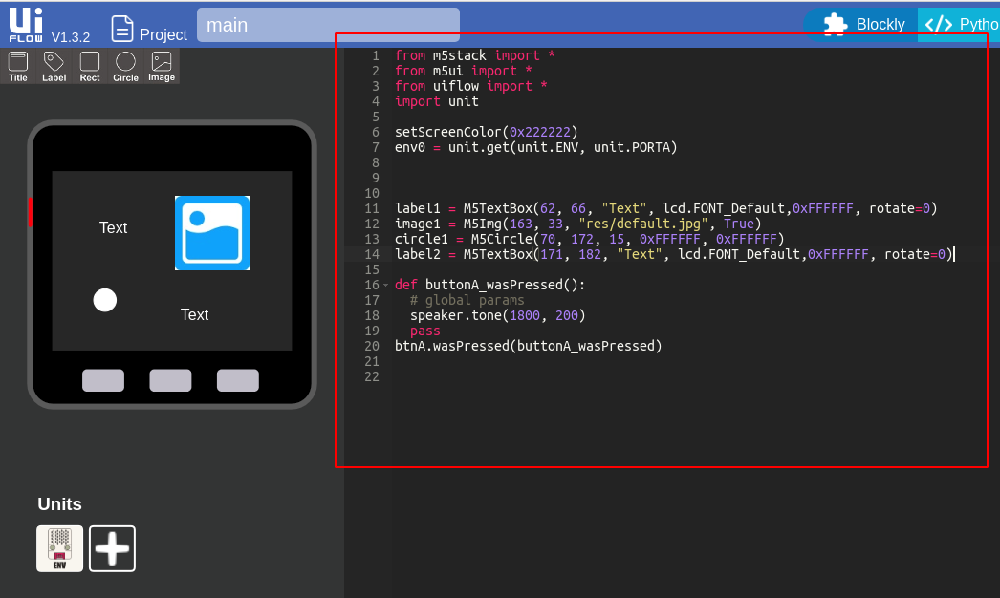

# UIFLow - lib

This lib show **UIFlow** and **UIFlow offline** python lib

All lib can be directly imported

UIFlow offline is a pure version of UIFlow

It only support m5stack hardware support(same as uiflow), such as lcd, button, sd card, units ......

Detailed api view https://github.com/m5stack/UIFlow-Code/wiki/Advanced

## UIFlow Office Quick Start

1.Download and flash firmware in https://github.com/m5stack/UIFlow-Code/firmware (firmware addr is 0x1000)

> note: begin flash please erase esp32  flash

2.Install vscode, and install Extensions ([vscode-m5stack-mpy](https://github.com/curdeveryday/vscode-m5stack-mpy))



3.Connect M5-Core to computer and make sure already install **Serial Driver**, Press **btnC** and **reboot**



If not, please go to https://docs.m5stack.com/#/en/quick_start/m5core/m5stack_core_get_started_MicroPython?id=_1-install-usb-to-serial-driver

4.Open vscode and choose your serial port, please make sure core is already in usb mode


- Open M5Stack file tree. If Device resets, please click the refresh button to reopen the file tree.


- Editor a file.


- Run in M5Stack.


- Save file. You can press `ctrl + s` or click `File->Save` to save file.


### How to Development

1.**boot.py** will run at first

2.next will run **main.py**

3.if want use **run in m5stack right now**, please note:

```python
from m5stack import *
from uiflow import *

while True:
    # must call in while True
    checkExit()
    # or
    wait_ms(1)
    # or
    wait(1)
```

4.example control lcd

- Core enter development mode (m5-micropython show in lcd), use vscode to connect

- Open main.py and write

``` python
from m5stack import *
from uiflow import *
from m5ui import *
import time

setScreenColor(0x222222)

label1 = M5TextBox(120, 103, "Text", lcd.FONT_Default,0xFFFFFF, rotate=0)

while True:
    label1.setText(str(time.ticks_ms()))
    checkExit()
```

- try use **run in m5stack** to test is the code correct?

- if ok, press **ctrl+s** to save, it will auto write to core

- reboot core(not enter development mode ),it will run....

## Offline with uiflow

try copy uiflow code to main.py, it will work well



### API

- Connect wifi, detail see [here](lib/wifiCfg.py)

```python
import wifiCfg
wifiCfg.doConnect(ssid, pwd)
# or
wifiCfg.autoConnect()
```

- web example go to [here](lib/wifiWebCfg.py)

## UIFlow Quick Start

firmware addr: https://github.com/EeeeBin/UIFlow-Firmware

How to use: https://docs.m5stack.com/#/en/quick_start/m5core/m5stack_core_get_started_MicroPython
